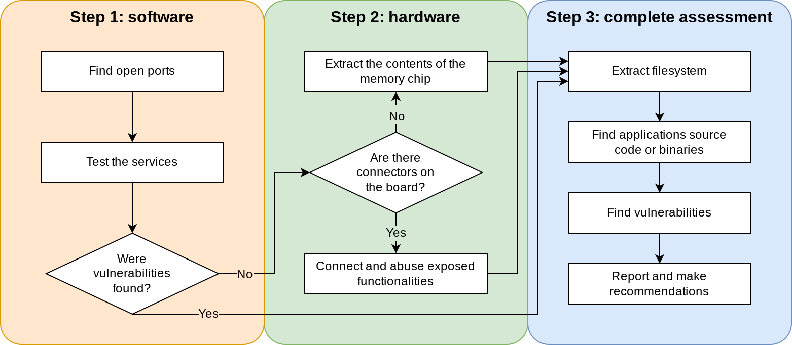
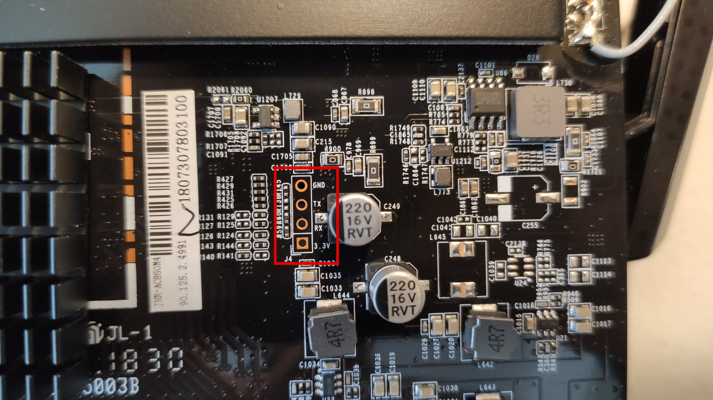
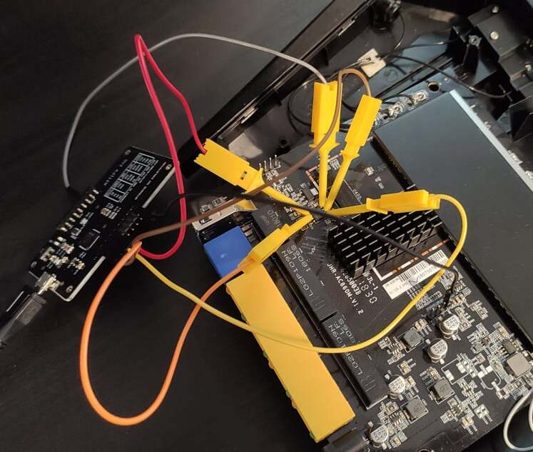

# Router Assessment Files
Images, scripts and code listings related to the article `Security assessment of a commercial router using physical access: a case study`.

## Section II. METHODOLOGY OVERVIEW
Methodology steps overview

## Section III. B. Serial Ports
Clearly visible port with named pins

## Section IV. A. Chip Hooking
Attify badge connected to the memory chip with hooks

## Section IV. B. Boot Menu
Boot menu of the board
~~~
Please choose the operation:
  1: Load system code to SDRAM via TFTP.
  2: Load system code then write to Flash via TFTP.
  3: Boot system code via Flash (default).
  4: Entr boot command line interface.
  7: Load Boot Loader code then write to Flash via Serial.
  9: Load Boot Loader code then write to Flash via TFTP.
  a: Load JCG firmware then write to Flash via TFTP.
~~~
U-Boot command line interface
~~~
U-Boot U-Boot 1.1.3 (Jul 20 2018 - 10:07:23)
MT7621 # help
?       - alias for 'help'
bootm   - boot application image from memory
cp      - memory copy
erase   - erase SPI FLASH memory
go      - start application at address 'addr'
help    - print online help
loadb   - load binary file over serial line (kermit mode)
md      - memory display
mdio   - Ralink PHY register R/W command !!
mm      - memory modify (auto-incrementing)
nm      - memory modify (constant address)
printenv- print environment variables
reset   - Perform RESET of the CPU
rf      - read/write rf register
saveenv - save environment variables to persistent storage
setenv  - set environment variables
spi     - spi command
tftpboot- boot image via network using TFTP protocol
version - print monitor version
~~~
Usage of the `spi` command
~~~
MT7621 # help spi
spi spi usage:
  spi id
  spi sr read
  spi sr write <value>
  spi read <addr> <len>
  spi erase <offs> <len>
  spi write <offs> <hex_str_value>
~~~

Two scripts were used to extract the firmware of the router:
- The [first](scripts/dump_flash.py) one to automatically dump the contents of the SPI chip
- The [second](scripts/reconstruct_flash.py) one to reconstruct the firmware binary
## Section VI. A. Command Injection
The decompiled `sysTools` function
~~~c
void sysTools(char *request)
{
  char *nest_page;
  char *tool;
  char *repeat;
  char *host;
  int tool_number;
  char iter;
  
  nest_page = websGetVar(request,"nextPage","adm/systools.asp");
  tool = websGetVar(request,"tool","");
  repeat = websGetVar(request,"repeat","");
  host = websGetVar(request,"host","");
  tool_number = atoi(tool);
  if (*repeat == '\0') {
    if (tool_number == 0) {
      tool = websGetVar(request,"pingCount","4");
      snprintf(&command,0x400,"%s -c %s %s 1>%s 2>&1",&ping,tool,host,"/var/systool.log");
    }
    else if (tool_number == 1) {
      snprintf(&command,0x400,"%s -n -m 4 %s 1>%s 2>&1","traceroute",host,"/var/systool.log");
    }
  }
  else {
    if (command == '\0') goto abort;
    doSystem(&command);
  }
  if (command != '\0') {
    if ((((command != ';') && (command != ',')) && (command != '|')) &&
       (((command != '\'' && (command != '\"')) && (command != '`')))) {
      tool = &command_second_char;
      do {
        iter = *tool;
        tool = tool + 1;
        if (iter == '\0') goto execute_command;
      } while (((iter != ';') && (iter != ',')) &&
              ((iter != '|' && (((iter != '\'' && (iter != '\"')) && (iter != '`'))))));
    }
    snprintf(&command,0x400,"echo InvalidCommand! 1>%s 2>&1","/var/systool.log");
execute_command:
    doSystem(&command);
  }
abort:
  websRedirect(request,nest_page);
  return;
}
~~~

## Section VI. B. Backdoors
The decompiled `system_command` function
~~~c
void system_command(char *request)
{
  char *user_command;
  int lan_ip;
  
  user_command = websGetVar(request,"command","");
  if ((user_command != (char *)0x0) && (lan_ip = isLanIp(request + 0x30,0), lan_ip != 0)) {
    if (*user_command == '\0') {
      snprintf(&command,0x400,"cat /dev/null > %s","/var/system_command.log");
    }
    else {
      snprintf(&command,0x400,"%s 1>%s 2>&1",user_command,"/var/system_command.log");
    }
    if (command != '\0') {
      doSystem(&command);
      websRedirect(request,"adm/system_command.asp");
      return;
    }
  }
  websRedirect(request,"adm/system_command.asp");
  return;
}
~~~